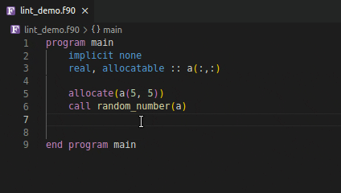
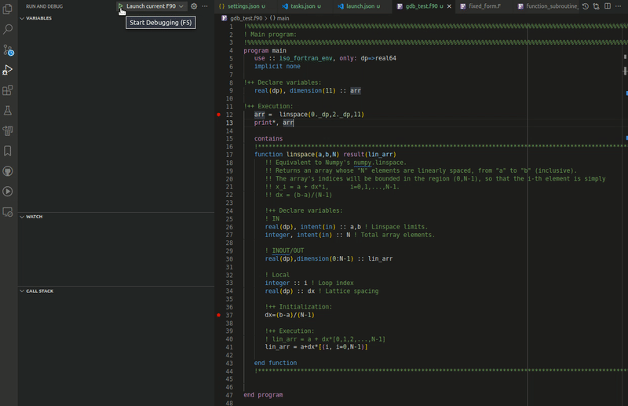

<p align="center">
  
</p>

<div align="center">

[](https://github.com/fortran-lang/vscode-fortran-support/actions)
[](https://marketplace.visualstudio.com/items?itemName=fortran-lang.linter-gfortran)
[](https://marketplace.visualstudio.com/items?itemName=fortran-lang.linter-gfortran)
[](https://marketplace.visualstudio.com/items?itemName=fortran-lang.linter-gfortran)
[](https://raw.githubusercontent.com/fortran-lang/vscode-fortran-support/master/LICENSE)

</div>

<div align="center">
  <a href="#key-features">Key Features</a> •
  <a href="#get-started--seek-support">Get Started</a> •
  <a href="#language-server-integration">LSP</a> •
  <a href="#linting">Lint</a> •
  <a href="#debugging">Debug</a> •
  <a href="#formatting">Format</a> •
  <a href="#snippets">Snippets</a> •
  <a href="#support-us">Donate</a>
  <br>
  <br>
</div>

<p align="center">
  
</p>

## Key Features

- Syntax highlighting (Free and Fixed forms)
- Hover support, Signature help and Auto-completion
- GoTo/Peek implementation and Find/Peek references
- Project-wide and Document symbol detection and Renaming
- [Native Language Server integration](#language-server-integration) with [`fortls`](https://github.com/gnikit/fortls)
- [Linting support](#linting) for GCC's [`gfortran`](https://gcc.gnu.org/wiki/GFortran), and Intel's [`ifort`](https://www.intel.com/content/www/us/en/developer/tools/oneapi/fortran-compiler.html), `ifx`
- [Interactive Debugger with UI](#debugging)
- [Formatting](#formatting) with [findent](https://github.com/gnikit/findent-pypi) or [fprettify](https://github.com/pseewald/fprettify)
- [Code snippets](#snippets) (more can be defined by the user [see](https://code.visualstudio.com/docs/editor/userdefinedsnippets#_create-your-own-snippets))

## Get Started & Seek Support

<p float="center">
  <a href="https://fortran-lang.org/learn/"></a>
  <a href="https://github.com/fortran-lang/vscode-fortran-support/discussions"></a>
  <a href="https://fortran-lang.discourse.group/"></a>
</p>

### Useful Tools

<p float="center">
  <a href="https://gnikit.github.io/fortls"></a>
  <a href="https://fpm.fortran-lang.org"></a>
  <a href="https://github.com/fortran-lang/stdlib"></a>
</p>

## Language Server integration

The Fortran Language Server [`fortls`](https://github.com/gnikit/fortls) is responsible
for providing a lot of the higher level, IDE functionality. By default,
`Modern Fortran` will attempt to use it for hover, autocompletion, symbols and Go to & Peeking into definitions.

Allow for `fortls` to be automatically installed with `pip` or `Anaconda` and
if the location where `fortls` is installed is not in your `PATH` point VS Code
to the `fortls` location by setting

```json
{
  "fortran.fortls.path": "/custom/path/to/fortls"
}
```

For more about the Language Server's capabilities please refer to the
[documentation](https://gnikit.github.io/fortls/) of `fortls`.

## Linting

Linting allows for compiler error and warning detection while coding
without the user having to compile.

Using an invalid if expression



Using incorrect type and rank as function argument


| 📝️ Note | Save your file to generate linting results |
| -------- | ------------------------------------------ |

Linting results can be improved by providing additional options to the compiler.

### Including directories

You can control the include paths to be used by the linter with the `fortran.linter.includePaths` option.

| ❗️ Important | For the best linting results `linter.includePaths` should match the included paths for your project's compilation. |
| ------------- | ------------------------------------------------------------------------------------------------------------------ |

```json
{
  "fortran.linter.includePaths": ["/usr/include/**", "${workspaceFolder}/include/**"]
}
```

| ❗️ Important | If a glob pattern is used only directories matching the pattern will be included |
| ------------- | -------------------------------------------------------------------------------- |

### Additional linting options

More options can be passed to the linter via

```json
{
  "fortran.linter.extraArgs": [
    "-fdefault-real-8",
    "-fdefault-double-8",
    "-Wunused-variable",
    "-Wunused-dummy-argument"
  ]
}
```

Default value is `-Wall` (or `-warn all` for ifort).

### Changing linting compiler

By default, the linter used is `gfortran`, Intel's `ifort` and Intel's LLVM based compiler `ifx` are also supported.
One can use a different linter compiler via the option

```jsonc
{
  "fortran.linter.compiler": "ifort" | "gfortran" | "ifx" | "Disabled"
}
```

The linter executable is assumed to be found in the `PATH`.
In order to use a different executable or if the executable can't be found in the `PATH`
you can point the extension to another linter with the `fortran.linter.compilerPath` option.

```json
{
  "fortran.linter.compilerPath": "/opt/oneapi/compiler/2022.0.2/linux/bin/intel64/ifort"
}
```

## Debugging



The extension uses the debugger from Microsoft's
[C/C++ extension](https://github.com/Microsoft/vscode-cpptools)
for Visual Studio Code. This allows this extension to use the full functionality
of the C/C++ extension for debugging applications:
(un)conditional breaking points, expression evaluation, multithreaded debugging,
call stack, stepping, watch window.

A minimal `launch.json` script, responsible for controlling the debugger, is
provided below. However, Visual Studio Code is also capable of autogenerating
a `launch.json` file and the configurations inside the file.

More details about how to set up the debugger can be found in Microsoft's website:

- General information about debugging in VS Code: <https://code.visualstudio.com/docs/editor/debugging>
- C/C++ extension debugger information: <https://code.visualstudio.com/docs/cpp/cpp-debug>
- Build tasks for easy compiling: <https://code.visualstudio.com/docs/editor/tasks>

<details>
<summary><b>Example: Launch.json</b></summary>

```jsonc
{
  // Use IntelliSense to learn about possible attributes.
  // Hover to view descriptions of existing attributes.
  // For more information, visit: https://go.microsoft.com/fwlink/?linkid=830387
  "version": "0.2.0",
  "configurations": [
    {
      "name": "(gdb) Fortran",
      "type": "cppdbg",
      "request": "launch",
      "program": "${workspaceFolder}/a.out",
      "args": [], // Possible input args for a.out
      "stopAtEntry": false,
      "cwd": "${workspaceFolder}",
      "environment": [],
      "externalConsole": false,
      "MIMode": "gdb",
      "setupCommands": [
        {
          "description": "Enable pretty-printing for gdb",
          "text": "-enable-pretty-printing",
          "ignoreFailures": true
        }
      ]
    }
  ]
}
```

</details>

## Formatting

Two formatters are supported [`findent`](https://github.com/gnikit/findent-pypi)
and [`fprettify`](https://github.com/pseewald/fprettify). Both of them can be
installed with `pip` automatically through the extension.

<details>
  <summary><b>Demo: formatters in action</b></summary>

|                findent                |                fprettify                |
| :-----------------------------------: | :-------------------------------------: |
|  |  |

</details>

The formatter is controlled by the user option

```jsonc
{
  "fortran.formatting.formatter": "findent" | "fprettify" | "Disabled"
}
```

Additional arguments to the formatter can be input using

```json
{
  "fortran.formatting.findentArgs": ["-Cn", "-Rr"],
  "fortran.formatting.fprettifyArgs": ["--whitespace-comma", "--enable-decl"]
}
```

If the formatter is not present in the `PATH` its location can be input with

```json
{
  "fortran.formatting.path": "/custom-path-to-formatter-binary"
}
```

| 📝️ Note | `findent` can also be used to generate dependency files for a project. |
| -------- | ---------------------------------------------------------------------- |

## Snippets

Snippets are included by both `fortls` Language Server and the Modern Fortran VS Code extension.
Some available snippets can be seen below. Users can define their own snippets
by following these VS Code [instructions](https://code.visualstudio.com/docs/editor/userdefinedsnippets).

If you think a snippet should be shipped by with the extension feel free to
submit a [feature request](https://github.com/fortran-lang/vscode-fortran-support/issues/new?assignees=&labels=feature-request&template=feature_request.md&title=)

<details>
<summary><b>Demo: snippets in action</b></summary>
<p float="left">
  
  
</p>
</details>

## Advanced options

To show the symbols in the file outline enable `provide.symbols`. Symbols can be
served by the fortls, the built-in, both or none. By default
`fortls` is used.

```jsonc
{
  "fortran.provide.symbols": "fortls" | "Built-in" | "Both" | "Disable"
}
```

You can also configure the case for fortran intrinsics auto-complete by using

```jsonc
{
    "fortran.preferredCase": "lowercase" | "uppercase"
}
```

## Requirements

For debugging you need to have one of the following debuggers installed:

- **Linux**: GDB
- **macOS**: GDB or LLDB
- **Windows**: GDB or Visual Studio Windows Debugger

## Contributing

- [Guidelines](https://github.com/fortran-lang/vscode-fortran-support/blob/master/CONTRIBUTING.md)
- [Code of conduct: Contributor Covenant](https://github.com/fortran-lang/.github/blob/main/CODE_OF_CONDUCT.md)
- [License](https://github.com/fortran-lang/vscode-fortran-support/blob/master/LICENSE)

## Support Us

You can support further development of the extension by fiscal donations:

<a href="https://numfocus.org/donate-to-lfortran"></a> to our [**LFortan**](https://numfocus.org/donate-to-lfortran) project on NumFOCUS

Or

<a href="https://github.com/fortran-lang/vscode-fortran-support"></a> directly sponsoring developers through [**GitHub Sponsors**](https://github.com/fortran-lang/vscode-fortran-support)
